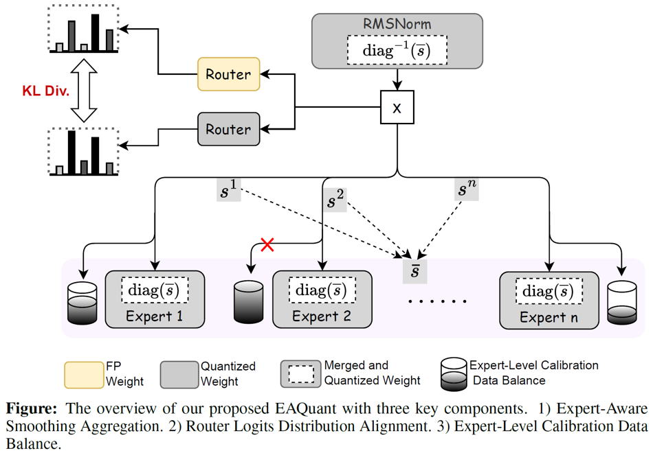

# EAQuant: Enhancing Post-Training Quantization for MoE Models via Expert-Aware Optimization


Welcome to the official code repository for "[EAQuant: Enhancing Post-Training Quantization for MoE Models via Expert-Aware Optimization](https://arxiv.org/abs/2506.13329)".


## 📰 News
* [2025/07/03] 🚀 we have implemented a pre-smoothing optimization for the Pangu-Pro-MoE model, now integrated into the two-stage quantization pipeline of the official Pangu-Pro-MoE-INT8 release!
* [2025/06/17] 🚀 We release the code!
* [2025/06/16] 🚀 Our paper is available on arXiv!

## 👀 Introduction


- EAQuant proposes (1) Expert-Aware Smoothing Aggregation to suppress activation outliers and stabilize quantization, (2) Expert-Aware Routing Consistency Alignment to preserve expert selection consistency post-quantization, and (3) Expert-Aware Calibration Data Balance to optimize sparsely activated experts.
- EAQuant establishs new **state-of-the-art** baselines for several extreme quantization settings (e.g., W4A4/W3A4/W3A3/W2A4) across various model types and downstream tasks.


## 🔧 Installation
```bash
conda create -n eaquant python=3.9 -y
conda activate eaquant
git clone https://github.com/darren-fzq/EAQuant.git
pip install --upgrade pip
pip install -r requirements.txt
```

## ⚙️ Usage
### 1. Preprocessing
```bash
python get_rot.py # need to be run only once for all models
```

### 2. Quantization
The bash script for `EAQuant` can be found in `run.sh`. You can choose the model to be quantized by providing model path after `--model` order. In addition, you can add `--save_dir` to save the quantized models, and use `--resume` to reload the saved models. 


#### Explanation of arguments:
- `--model`: the local model path or huggingface format.
- `--wbits`: weight quantization bits.
- `--abits`: activation quantization bits.
- `--router_wbits`: weight quantization bits of the gate layer.
- `--router_abits`: activation quantization bits of the gate layer.
- `--smooth`: suppress activation outliers with mathematical equivalence transformations.
- `--fc1_scale_merge`: expert-aware smoothing aggregation strategy.
- `--a_dynamic_method`: the dynamic_method of activation.
- `--w_dynamic_method`: the dynamic_method of weight.
- `--router_w_dynamic_method`: the dynamic_method of the gate layer's weight.
- `--expert_token_num_ratio`: the ratio of expect expert_token_num over average expert_token_num.
- `--swc`: the ratio of weight clipping (enable without LWC operation).
- `--lac`: the ratio of activation clipping.
- `--lwc`: activate the Learnable Weight Clipping (LWC).
- `--epochs`: the training epochs of LWC.
- `--resume`: loading pre-trained DuQuant parameters.
- `--save_dir`: saving the quantization model for further exploration.
- `--eval_ppl`: evaluating the perplexity of quantized models.
- `--tasks`: evaluating on the zero-shot tasks.


## 🙏 Acknowledgement
This repo is built upon the following projects:

* [OmniQuant](https://github.com/OpenGVLab/OmniQuant)
* [DuQuant](https://github.com/Hsu1023/DuQuant)
* [OSTQuant](https://github.com/BrotherHappy/OSTQuant)

We thank the authors for their code.

## 📝 Citation
We kindly request that you cite our work if you utilize the code or reference our findings in your research:
<!-- Please cite our work if you use our code or discuss our findings in your own research: -->
```bibtex
@misc{fu2026eaquantenhancingposttrainingquantization,
      title={EAQuant: Enhancing Post-Training Quantization for MoE Models via Expert-Aware Optimization}, 
      author={Zhongqian Fu and Tianyi Zhao and Ning Ding and Xianzhi Yu and Xiaosong Li and Yehui Tang and Yunhe Wang},
      year={2026},
      eprint={2506.13329},
      archivePrefix={arXiv},
      primaryClass={cs.CL},
      url={https://arxiv.org/abs/2506.13329}, 
}
```
